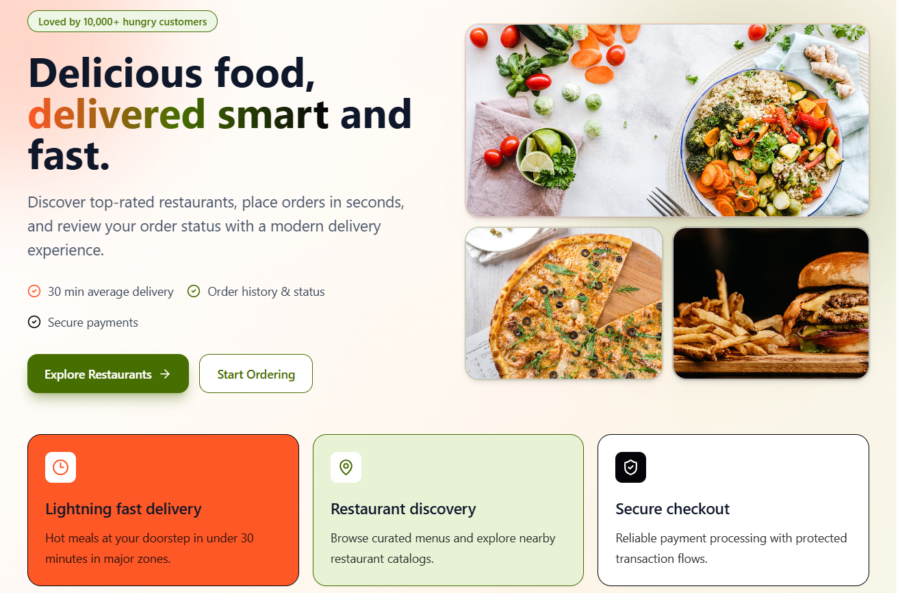
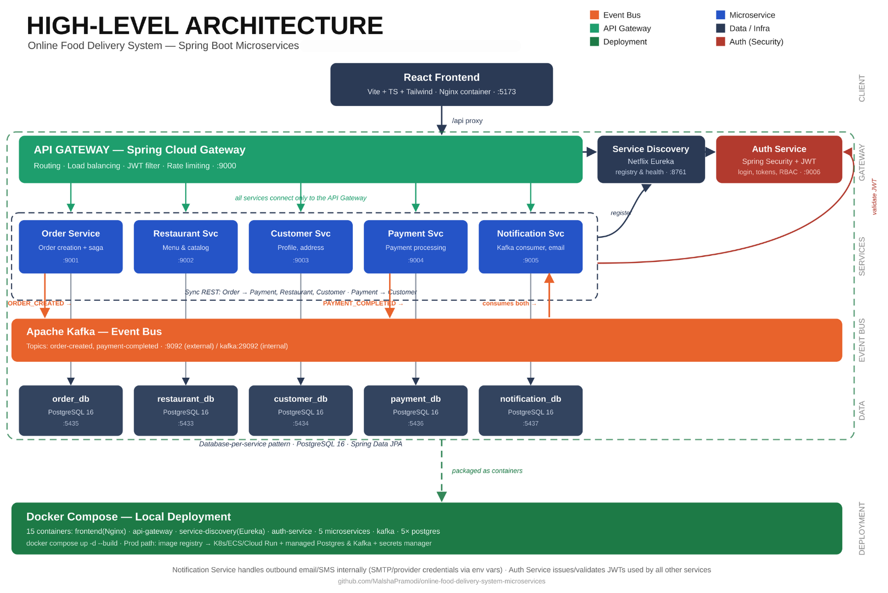
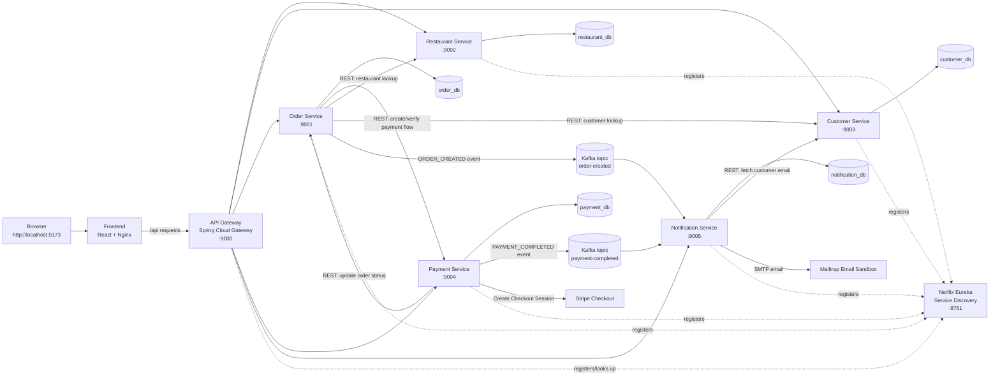

# Online Food Delivery System

Microservices-based online food delivery platform built with Spring Boot, Spring Cloud Netflix Eureka, Spring Cloud Gateway, PostgreSQL, Kafka, React frontend UI and Docker Compose.



## Introduction

The Online Food Delivery System is a distributed microservices application for managing the main workflow of a food delivery platform. Customers can browse restaurants, add menu items to a cart, place orders, complete payment and view order/payment notifications. Restaurant owners can manage restaurant menu data and view incoming orders. Admin/operations users can inspect restaurant, customer, order, payment, in a dashboard with inspection tables for all services' data .

The main goal is to demonstrate a production-style microservice architecture with independent backend services, service discovery, API gateway routing, database-per-service persistence, asynchronous Kafka messaging, and containerized deployment.

- separate Spring Boot services for different business functions
- database-per-service persistence with PostgreSQL
- service registration and discovery with Netflix Eureka
- centralized routing with Spring Cloud Gateway
- synchronous REST communication between services
- asynchronous Kafka event messaging for notifications
- Stripe Checkout integration for payment processing
- Mailtrap SMTP sandbox for safe email notification testing
- React frontend served through Nginx
- full Docker Compose deployment

Core features:

- Customer registration/login and customer profile management
- Restaurant registration/login
- Restaurant and food menu management
- Cart and checkout workflow
- Order creation and restaurant order viewing
- Payment records and payment history
- Kafka-based order/payment notification events for order creation and payment completion
- Email notification delivery through Mailtrap
- Update the status of the order on both ends customer and restaurant
- React frontend that communicates with backend services through the API Gateway
- Full Docker Compose deployment for local production-like demonstration

## Architecture



### Service Communication and Data Flow



### Design Decisions

- **Business capability split**: The system is divided into Restaurant, Customer, Order, Payment, and Notification services so each service owns a focused responsibility.
- **Database-per-service**: Each core service has its own PostgreSQL database. This reduces coupling and demonstrates service-owned data.
- **Netflix Eureka service discovery**: Backend services register with Eureka so the gateway and services can discover running instances.
- **API Gateway entry point**: The frontend communicates through API Gateway instead of calling each backend service directly.Spring Cloud Gateway is used as the single entry point for the application.
- **REST + Kafka communication**: REST is used for direct request/response workflows, while Kafka is used for asynchronous notification events so order and payment processing are not tightly coupled to email delivery.
- **Stripe-hosted payment**: Card data is entered on Stripe Checkout instead of being collected directly by this application.
- **Mailtrap sandbox email**: Mailtrap captures test emails safely during local development and evaluation.
- **Docker Compose deployment**: The whole distributed system is containerized to provide a consistent production-like envronment for the deployment.

## Microservices

### Implementation Methods

The backend is implemented with Spring Boot and Spring Cloud. The Netflix software stack is used through Spring Cloud Netflix Eureka.

-service-discovery: Eureka Server
-api-gateway: Eureka Client and Spring Cloud Gateway
-Backend services: Eureka Clients registered with the discovery server

Main technologies:

- Java 17
- Spring Boot
- Spring Cloud Netflix Eureka
- Spring Cloud Gateway
- Spring Data JPA
- PostgreSQL
- Apache Kafka
- Stripe Checkout API
- JavaMailSender with Mailtrap SMTP
- React, TypeScript, Vite, Tailwind CSS
- Docker and Docker Compose

### Service Summary

| Service                | Port | Database          | Main Responsibility                                                 |
| ---------------------- | ---: | ----------------- | ------------------------------------------------------------------- |
| `service-discovery`    | 8761 | -                 | Eureka server for service registration and discovery                |
| `api-gateway`          | 9000 | -                 | Single backend entry point for client requests and route forwarding |
| `restaurant-service`   | 9002 | `restaurant_db`   | Manage Restaurant accounts and menu items                           |
| `customer-service`     | 9003 | `customer_db`     | Manages Customer profiles, addresses, and payment information       |
| `order-service`        | 9001 | `order_db`        | Mnages Orders, order status and order history                       |
| `payment-service`      | 9004 | `payment_db`      | Manages payment records, and payment history                        |
| `notification-service` | 9005 | `notification_db` | Kafka consumers, notification records, and email delivery           |
| `Kafka`                | 9092 | -                 | Event broker for order and payment notification events.             |

### Restaurant Service

The system uses a Spring Boot Restaurant Service to manage restaurant and menu-related features.

- API Gateway URL: `http://localhost:9000/restaurants`

Functionality:

- Creates and manages restaurant accounts.
- Supports restaurant login.
- Stores restaurant profile information.
- Manages food menu items for each restaurant.

REST endpoints:

| Method | Endpoint                            | Description                         |
| ------ | ----------------------------------- | ----------------------------------- |
| POST   | `/restaurants`                      | Create a new restaurant             |
| POST   | `/restaurants/login`                | Restaurant login                    |
| GET    | `/restaurants`                      | Get all restaurants                 |
| GET    | `/restaurants/{id}`                 | Get restaurant by id                |
| PUT    | `/restaurants/{id}`                 | Update a restaurant by id           |
| DELETE | `/restaurants/{id}`                 | Delete a restaurant by id           |
| POST   | `/restaurants/{restaurantId}/menus` | Add food menu item to a restaurant  |
| GET    | `/restaurants/{restaurantId}/menus` | Get all menu items for a restaurant |
| GET    | `/restaurants/menus/{menuId}`       | Get a menu item by id               |
| PUT    | `/restaurants/menus/{menuId}`       | Update a menu item                  |
| DELETE | `/restaurants/menus/{menuId}`       | Delete a menu item                  |

Inter-service interactions:

- `order-service` calls Restaurant Service to fetch restaurant details.
- Frontend accesses Restaurant Service through API Gateway routes.

### Customer Service

The system uses a Spring Boot Customer Service to manage customer profiles, addresses, and payment method metadata.

- API Gateway URL: `http://localhost:9000/customers`

Functionality:

- Creates and manages customer accounts.
- Supports customer login.
- Stores customer addresses.
- Stores customer payment method metadata.

REST endpoints:

| Method | Endpoint                                       | Description                  |
| ------ | ---------------------------------------------- | ---------------------------- |
| POST   | `/customers`                                   | Create a new customer        |
| POST   | `/customers/login`                             | Customer login               |
| GET    | `/customers`                                   | Get all customers            |
| GET    | `/customers/{id}`                              | Get customer by id           |
| PUT    | `/customers/{id}`                              | Update customer              |
| DELETE | `/customers/{id}`                              | Delete customer              |
| POST   | `/customers/{customerId}/addresses`            | Add address for a customer   |
| GET    | `/customers/{customerId}/addresses`            | Get customer addresses       |
| GET    | `/customers/addresses/{addressId}`             | Get address by id            |
| PUT    | `/customers/addresses/{addressId}`             | Update address               |
| DELETE | `/customers/addresses/{addressId}`             | Delete address               |
| POST   | `/customers/{customerId}/payment-methods`      | Add payment method metadata  |
| GET    | `/customers/{customerId}/payment-methods`      | Get customer payment methods |
| GET    | `/customers/payment-methods/{paymentMethodId}` | Get payment method by id     |
| PUT    | `/customers/payment-methods/{paymentMethodId}` | Update payment method        |
| DELETE | `/customers/payment-methods/{paymentMethodId}` | Delete payment method        |

Inter-service interactions:

- `notification-service` calls Customer Service to fetch the customer email before sending an email.
- `payment-service` can call Customer Service to fetch saved payment method metadata when card validation mode is enabled.
- `order-service` can call Customer Service for customer-related lookup workflows.

### Order Service

The system uses a Spring Boot Order Service to manage order creation, order status, and order history.

- API Gateway URL: `http://localhost:9000/order`

Functionality:

- Creates customer orders.
- Stores ordered food items.
- Tracks order status.
- Provides customer and restaurant order history.
- Publishes `ORDER_CREATED` Kafka events.

REST endpoints:

| Method | Endpoint                                  | Description                                  |
| ------ | ----------------------------------------- | -------------------------------------------- |
| POST   | `/order/create`                           | Create a new order                           |
| GET    | `/order`                                  | Get all orders                               |
| GET    | `/order/{orderId}`                        | Get order by id                              |
| PUT    | `/order/{orderId}/status`                 | Update order status                          |
| GET    | `/order/user/{userId}`                    | Get orders for customer                      |
| GET    | `/order/restaurant-orders/{restaurantId}` | Get orders for restaurant                    |
| GET    | `/order/restaurant/{restaurantId}`        | Get restaurant details through Order Service |

Inter-service interactions:

- Calls Restaurant Service to fetch restaurant details.
- Calls Customer Service to fetch customer information.
- Calls Payment Service, saves the order as `CREATED` and waits for Payment Service to confirm Stripe payment.
- Receives order status updates from Payment Service after successful payment.
- Publishes `ORDER_CREATED` event to Kafka for Notification Service.

### Payment Service

The system uses a Spring Boot Payment Service to manage payment processing, payment records and history.

- API Gateway URL: `http://localhost:9000/payment`

Functionality:

- Creates Checkout sessions.
- Confirms Checkout sessions after successful redirect.
- Stores payment records.
- Updates order status after successful payment.
- Publishes `PAYMENT_COMPLETED` Kafka events.
- Provides payment history APIs.

REST endpoints:

| Method | Endpoint                                | Description                     |
| ------ | --------------------------------------- | ------------------------------- |
| POST   | `/payment/save`                         | Save/process a payment          |
| POST   | `/payment/checkout/session`             | Create Checkout Session         |
| POST   | `/payment/checkout/confirm/{sessionId}` | Confirm Checkout Session        |
| GET    | `/payment/all`                          | Get all payments                |
| GET    | `/payment/{id}`                         | Get payment by id               |
| GET    | `/payment/order/{orderId}`              | Get payment history by order id |

Inter-service interactions:

- Calls Stripe Checkout API to create and retrieve checkout sessions.
- Calls Order Service to mark an order as `PAID` after Stripe confirms payment.
- Publishes `PAYMENT_COMPLETED` event to Kafka for Notification Service.
- Can call Customer Service for payment method metadata if card validation is enabled.

Stripe configuration:

```env
PAYMENT_GATEWAY_MODE=stripe
STRIPE_SECRET_KEY=sk_test_your_secret_key
STRIPE_CURRENCY=lkr
STRIPE_SUCCESS_URL=http://localhost:5173/checkout/success?session_id={CHECKOUT_SESSION_ID}
STRIPE_CANCEL_URL=http://localhost:5173/checkout/cancel
```

### Notification Service

The system uses a Spring Boot Notification Service to manage notification records, Kafka notification consumers, and SMTP email delivery.

- API Gateway URL: `http://localhost:9000/notifications`

Functionality:

- Consumes Kafka notification events.
- Stores notification records.
- Fetches customer email from Customer Service.
- Sends email through Mailtrap SMTP when enabled.
- Marks notification records as sent only after successful email delivery.

The Notification Service stores notification records generated from Kafka events. Order Service publishes an ORDER_CREATED event to the order-created topic after an order is saved. Payment Service publishes a PAYMENT_COMPLETED event to the payment-completed topic after a payment is saved as PAID. Notification Service consumes both topics, persists notification records in notification_db, sends email through SMTP when enabled, and marks records as sent only after successful delivery

REST endpoints:

| Method | Endpoint                               | Description                    |
| ------ | -------------------------------------- | ------------------------------ |
| POST   | `/notifications`                       | Create notification manually   |
| GET    | `/notifications`                       | Get all notifications          |
| GET    | `/notifications/{id}`                  | Get notification by id         |
| GET    | `/notifications/customer/{customerId}` | Get notifications for customer |
| GET    | `/notifications/order/{orderId}`       | Get notifications for an order |
| PUT    | `/notifications/{id}/sent`             | Mark notification as sent      |

Kafka Notification System
Kafka is used for asynchronous notification delivery between the Order, Payment, and Notification services. This keeps order placement and payment processing decoupled from email delivery.

Kafka topics:

| Topic               | Producer          | Consumer               | Event Type          |
| ------------------- | ----------------- | ---------------------- | ------------------- |
| `order-created`     | `order-service`   | `notification-service` | `ORDER_CREATED`     |
| `payment-completed` | `payment-service` | `notification-service` | `PAYMENT_COMPLETED` |

### Event Flow

1. Customer places an order from the frontend.
2. `order-service` saves the order in `order_db`.
3. `order-service` publishes an `ORDER_CREATED` event to Kafka topic `order-created`.
4. `order-service` calls `payment-service`.
5. `payment-service` saves the payment as `PAID` in `payment_db`.
6. `payment-service` publishes a `PAYMENT_COMPLETED` event to Kafka topic `payment-completed`.
7. `notification-service` consumes both Kafka topics.
8. `notification-service` saves notification records in `notification_db`.
9. If SMTP email delivery is enabled, `notification-service` sends each email and marks the notification as `sent=true` only after successful delivery.

Because `order-created` and `payment-completed` are separate Kafka topics, strict ordering between those two event types is not guaranteed. Both records are tied to the same `orderId`, and each record has its own `sent` and `sentAt` status.

### Notification Event Payload

The Kafka message contains the data needed by the Notification Service:

```json
{
  "customerId": 11,
  "orderId": 19,
  "type": "ORDER_CREATED",
  "channel": "EMAIL",
  "message": "Your order has been placed successfully."
}
```

### Notification API Verification

After placing an order, open this URL in the browser or Postman:

```text
http://localhost:9000/notifications
```

You should see notification records similar to:

```json
[
  {
    "id": 34,
    "customerId": 11,
    "orderId": 19,
    "type": "ORDER_CREATED",
    "channel": "EMAIL",
    "message": "Your order has been placed successfully.",
    "sent": true,
    "createdAt": "2026-07-01T03:52:31.167299",
    "sentAt": "2026-07-01T03:52:56.541647"
  },
  {
    "id": 33,
    "customerId": 11,
    "orderId": 19,
    "type": "PAYMENT_COMPLETED",
    "channel": "EMAIL",
    "message": "Your payment has been completed successfully.",
    "sent": true,
    "createdAt": "2026-07-01T03:52:31.167299",
    "sentAt": "2026-07-01T03:52:39.882177"
  }
]
```

Inter-service interactions:

- Consumes events from Kafka.
- Calls Customer Service to fetch the email address.
- Sends email using Mailtrap SMTP.

Mailtrap configuration:

The project uses Mailtrap Email Sandbox for safe SMTP testing. Mailtrap captures emails instead of delivering them to real inboxes, so demo emails can be tested without using Gmail or sending real customer emails.

To enable Mailtrap SMTP delivery, configure these environment variables before starting notification-service:

```env
NOTIFICATION_EMAIL_ENABLED=true
NOTIFICATION_EMAIL_FROM=no-reply@food-delivery-demo.com
SMTP_HOST=sandbox.smtp.mailtrap.io
SMTP_PORT=587
SMTP_USERNAME=your_mailtrap_username
SMTP_PASSWORD=your_mailtrap_password
SMTP_AUTH=true
SMTP_STARTTLS_ENABLE=true
```

### Discovery Server

The Discovery Server is implemented using Spring Cloud Netflix Eureka server for service discovery.

Configuration:

```properties
spring.application.name=service-discovery
server.port=8761
eureka.client.register-with-eureka=false
eureka.client.fetch-registry=false
```

Role:

- Runs on `http://localhost:8761`.
- Allows backend services to register themselves.
- Shows registered service instances in the Eureka dashboard.
- Helps API Gateway and services discover other services.

### API Gateway

The API Gateway is implemented using Spring Cloud Gateway and Eureka Client. It is the single entry point for client requests.

Configuration summary:

```properties
spring.application.name=api-gateway
server.port=9000
eureka.client.service-url.defaultZone=${EUREKA_DEFAULT_ZONE:http://localhost:8761/eureka/}
spring.cloud.gateway.server.webmvc.discovery.locator.enabled=true
spring.cloud.gateway.server.webmvc.discovery.locator.lower-case-service-id=true
```

Configured gateway routes:

| Path                | Target Service         |
| ------------------- | ---------------------- |
| `/restaurants/**`   | `restaurant-service`   |
| `/customers/**`     | `customer-service`     |
| `/order/**`         | `order-service`        |
| `/payment/**`       | `payment-service`      |
| `/notifications/**` | `notification-service` |

Role:

- Provides one backend entry point at `http://localhost:9000`.
- Hides internal service ports from the frontend.
- Routes requests to services registered in Eureka.
- Keeps frontend API calls consistent through `/api` proxying.

## User Interface

### Implementation Details

The frontend is implemented with:

- React
- TypeScript
- Vite
- Tailwind CSS
- React Router
- Axios
- Nginx for Docker production serving

Frontend URL:

```text
http://localhost:5173
```

Frontend communication:

```text
Browser -> Frontend Nginx -> /api proxy -> API Gateway -> Microservices
```

Main UI areas:

- Customer signup/login
- Restaurant signup/login
- Customer restaurant browsing
- Restaurant menu view
- Cart and Stripe checkout
- Customer orders
- Customer notifications
- Restaurant owner dashboard
- Restaurant owner menu management
- Restaurant owner order view
- Admin/operations tables for services

Stripe checkout flow in UI:

1. Customer adds items to cart.
2. Customer clicks **Pay with Stripe**.
3. Frontend creates the order through Order Service.
4. Frontend requests a Stripe Checkout Session from Payment Service.
5. Customer is redirected to Stripe-hosted checkout.
6. Stripe redirects back to `/checkout/success`.
7. Frontend asks Payment Service to confirm the session.
8. Payment Service saves payment, updates order status, and publishes Kafka event.

### API Testing Tools

The APIs were tested through:

- Browser development tool for frontend workflows
- Browser API calls
- Postman for testing API requests through API Gateway
- Docker logs
- Mailtrap inbox
- Stripe test card flow

#### Postman Testing Examples

**Restaurant APIs** can be accessed through the API Gateway

Example restaurant creation request:

**Method:** POST  
**URL:** `http://localhost:9000/restaurants`

Request body:

```json
{
  "name": "Pizza Palace",
  "email": "pizzapalace@example.com",
  "password": "password123",
  "location": "Colombo",
  "cuisineType": "Italian",
  "active": true
}
```

Example response:

```json
{
  "id": 1,
  "name": "Pizza Palace",
  "email": "pizzapalace@example.com",
  "location": "Colombo",
  "cuisineType": "Italian",
  "active": true
}
```

**Get all restaurants:**

**Method:** GET  
**URL:** `http://localhost:9000/restaurants`

**Get restaurant by ID:**

**Method:** GET  
**URL:** `http://localhost:9000/restaurants/1`

---

**Food Menu APIs** can be accessed through the API Gateway

Example add food menu request:

**Method:** POST  
**URL:** `http://localhost:9000/restaurants/1/menus`

Request body:

```json
{
  "foodName": "Chicken Pizza",
  "foodDescription": "Large chicken pizza with mozzarella cheese",
  "foodCategory": "Pizza",
  "foodPrice": 2500.0,
  "available": true
}
```

Example response:

```json
{
  "id": 1,
  "foodName": "Chicken Pizza",
  "foodDescription": "Large chicken pizza with mozzarella cheese",
  "foodCategory": "Pizza",
  "foodPrice": 2500.0,
  "available": true,
  "restaurant": {
    "id": 1,
    "name": "Pizza Palace"
  }
}
```

**Get all menu items for a restaurant:**

**Method:** GET  
**URL:** `http://localhost:9000/restaurants/1/menus`

**Get menu item by ID:**

**Method:** GET  
**URL:** `http://localhost:9000/restaurants/menus/1`

---

**Customer APIs** can be accessed through the API Gateway

Example customer registration request:

**Method:** POST  
**URL:** `http://localhost:9000/customers`

Request body:

```json
{
  "fullName": "John Doe",
  "email": "john@example.com",
  "phone": "+94771234567",
  "password": "password123"
}
```

Example response:

```json
{
  "id": 1,
  "fullName": "John Doe",
  "email": "john@example.com",
  "phone": "+94771234567",
  "active": true
}
```

**Get all customers:**

**Method:** GET  
**URL:** `http://localhost:9000/customers`

**Get customer by ID:**

**Method:** GET  
**URL:** `http://localhost:9000/customers/1`

---

**Order APIs** can be accessed through the API Gateway

Example create order request:

**Method:** POST  
**URL:** `http://localhost:9000/order/create`

Request body:

```json
{
  "userId": 1,
  "restaurantId": 1,
  "restaurantName": "Pizza Palace",
  "totalPrice": 3000.0,
  "foodItems": [
    {
      "foodMenuId": 1,
      "foodName": "Chicken Pizza",
      "foodPrice": 2500.0,
      "quantity": 1
    },
    {
      "foodMenuId": 2,
      "foodName": "Coke",
      "foodPrice": 500.0,
      "quantity": 1
    }
  ]
}
```

Example response:

```json
{
  "id": 1,
  "userId": 1,
  "restaurantId": 1,
  "restaurantName": "Pizza Palace",
  "orderTime": "2026-05-23T20:00:00",
  "orderStatus": "CREATED",
  "totalPrice": 3000.0,
  "foodItems": [
    {
      "id": 1,
      "foodMenuId": 1,
      "foodName": "Chicken Pizza",
      "foodPrice": 2500.0,
      "quantity": 1
    },
    {
      "id": 2,
      "foodMenuId": 2,
      "foodName": "Coke",
      "foodPrice": 500.0,
      "quantity": 1
    }
  ]
}
```

**Get all orders:**

**Method:** GET  
**URL:** `http://localhost:9000/order`

**Get order by ID:**

**Method:** GET  
**URL:** `http://localhost:9000/order/1`

**Get orders for a customer:**

**Method:** GET  
**URL:** `http://localhost:9000/order/user/1`

**Get orders for a restaurant:**

**Method:** GET  
**URL:** `http://localhost:9000/order/restaurant-orders/1`

---

**Stripe test card:**

```text
Card Number (test card): 4242 4242 4242 4242
Expiry: Future date (MM/YY)
CVC: 3-digit number
Cardholder Name
```

## Deployment

### Local Docker Deployment

The project uses Docker Compose to run the full distributed system:

- PostgreSQL databases
- Kafka
- Eureka Service Discovery
- API Gateway
- Restaurant Service
- Customer Service
- Order Service
- Payment Service
- Notification Service
- Frontend

#### Port Ranges

The following port ranges are used by Docker containers:

| Component         | Port Range | Description                                                                              |
| ----------------- | ---------- | ---------------------------------------------------------------------------------------- |
| Frontend          | 5173       | React + Nginx web interface                                                              |
| Databases         | 5433-5437  | PostgreSQL instances (restaurant_db, customer_db, order_db, payment_db, notification_db) |
| Service Discovery | 8761       | Netflix Eureka service registry                                                          |
| Message Broker    | 9092       | Apache Kafka                                                                             |
| API Gateway       | 9000       | Spring Cloud Gateway entry point                                                         |
| Microservices     | 9001-9005  | Order (9001), Restaurant (9002), Customer (9003), Payment (9004), Notification (9005)    |

**Note:** Ensure these ports are available on your host machine before starting the containers. If ports are already in use, modify the `docker-compose.yml` file accordingly.

Start the full system:

```bash
docker compose up -d --build
```

Start again without rebuilding:

```bash
docker compose up -d
```

Check containers:

```bash
docker compose ps
```

View logs:

```bash
docker compose logs -f payment-service
docker compose logs -f notification-service
```

Stop containers while keeping database volumes:

```bash
docker compose down
```

Reset containers and database volumes:

```bash
docker compose down -v
```

Main local URLs:

```text
Frontend: http://localhost:5173
API Gateway: http://localhost:9000
Eureka Dashboard: http://localhost:8761
```

### Local Environment Variables

Create a local `.env` file in the project root. This file is ignored by Git.

```env
PAYMENT_GATEWAY_MODE=stripe
STRIPE_SECRET_KEY=sk_test_your_secret_key
STRIPE_CURRENCY=lkr
STRIPE_SUCCESS_URL=http://localhost:5173/checkout/success?session_id={CHECKOUT_SESSION_ID}
STRIPE_CANCEL_URL=http://localhost:5173/checkout/cancel

NOTIFICATION_EMAIL_ENABLED=true
NOTIFICATION_EMAIL_FROM=no-reply@food-delivery-demo.com
SMTP_HOST=sandbox.smtp.mailtrap.io
SMTP_PORT=587
SMTP_USERNAME=your_mailtrap_username
SMTP_PASSWORD=your_mailtrap_password
SMTP_AUTH=true
SMTP_STARTTLS_ENABLE=true
```

After changing `.env`, recreate affected containers:

```bash
docker compose up -d --force-recreate order-service payment-service notification-service frontend
```

### Cloud Deployment Suggestion

For production, the system can be deployed using Docker images and a container orchestration platform.

Recommended cloud deployment process:

1. Build Docker images for every service.
2. Push images to Docker Hub, GitHub Container Registry, AWS ECR, Azure Container Registry, or Google Artifact Registry.
3. Deploy services to Kubernetes, AWS ECS, Azure Container Apps, or Google Cloud Run.
4. Replace local PostgreSQL containers with managed PostgreSQL databases.
5. Replace local Kafka with a managed Kafka service such as Confluent Cloud or AWS MSK.
6. Store Stripe, SMTP, and database credentials in a secret manager such as Kubernetes Secrets, AWS Secrets Manager, Azure Key Vault, or GCP Secret Manager.
7. Expose only the frontend and API Gateway publicly.
8. Keep databases, Kafka, and internal services private.
9. Add HTTPS, health checks, centralized logs, monitoring, and backups policies.

## Source Code

GitHub repository:

```text
https://github.com/MalshaPramodi/online-food-delivery-system-microservices.git
```

## Development Challenges

| Challenge                                                                       | Solution                                                                            |
| ------------------------------------------------------------------------------- | ----------------------------------------------------------------------------------- |
| Configuring services for both local Maven runs and Docker containers            | Used environment-variable based configuration with local defaults                   |
| Service discovery and routing across containers                                 | Used Eureka service names and Spring Cloud Gateway routes                           |
| Kafka notification delivery                                                     | Added producers in Order and Payment services and consumers in Notification Service |
| Mailtrap rate limits                                                            | Added serialized email sending and retry delay in Notification Service              |
| Avoiding raw card handling                                                      | Integrated Stripe Checkout so card details are entered on Stripe-hosted pages       |
| Calling external Stripe API from a service that also uses Eureka load balancing | Used a dedicated non-load-balanced RestTemplate for Stripe API calls                |
| Full system startup complexity                                                  | Added Dockerfiles and Docker Compose for all services                               |
| Frontend API routing in Docker                                                  | Served React through Nginx and proxied `/api` requests to API Gateway               |

## Execution Flow

1. Run `docker compose up -d`.
2. Show `docker compose ps`.
3. Open Eureka dashboard at `http://localhost:8761`.
4. Open frontend at `http://localhost:5173`.
5. Login as a customer.
6. Browse restaurants and add menu items to cart.
7. Click **Pay with Stripe**.
8. Complete Stripe payment.
9. Show order status as `PAID`.
10. Show customer notifications as `Sent`.
11. Show Mailtrap captured emails.
12. Show restaurant owner order view.
13. Show API response from `http://localhost:9000/notifications/customer/{customerId}`.
