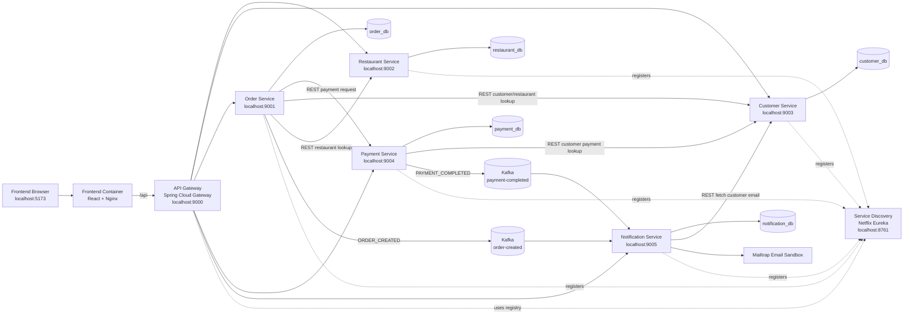

# Online Food Delivery System

Microservices-based online food delivery platform with API Gateway, service discovery, frontend UI, PostgreSQL, and Kafka support.

## Introduction

The Online Food Delivery System is a distributed microservices application for browsing restaurants, managing menus, creating customer orders, processing payments, and sending order/payment notifications. The main goal is to demonstrate a production-style microservice architecture with independent backend services, service discovery, API gateway routing, database-per-service persistence, asynchronous Kafka messaging, and containerized deployment.

Core features:

- Customer registration/login and customer profile management
- Restaurant registration/login and menu management
- Customer order placement and restaurant order viewing
- Payment processing for created orders
- Kafka-based notification events for order creation and payment completion
- Email notification delivery through Mailtrap SMTP sandbox
- React frontend that communicates with backend services through the API Gateway
- Full Docker Compose deployment for local production-like demonstration

## Architecture

### Architectural Diagram



### Design Decisions

- The application is split by business capability: restaurant/menu, customer, order, payment, and notification.
- Each core service owns its own PostgreSQL database, following the database-per-service pattern.
- Spring Cloud Netflix Eureka is used for service registration and discovery.
- Spring Cloud Gateway is used as the single entry point for frontend/API clients.
- Kafka is used for asynchronous notification events so order and payment processing are not tightly coupled to email delivery.
- Docker Compose runs the full system in containers to provide a repeatable production-like demo environment.

## Microservices Implementation Methods

The backend is implemented with Spring Boot and Spring Cloud. The Netflix software stack is represented by Spring Cloud Netflix Eureka:

- `service-discovery`: Eureka Server
- `api-gateway`: Eureka Client and Spring Cloud Gateway
- Backend services: Eureka Clients registered with the discovery server

Supporting technologies:

- PostgreSQL for service-owned persistence
- Apache Kafka for asynchronous event-driven communication
- Spring Data JPA for database access
- React, TypeScript, Vite, Tailwind CSS, and Nginx for the frontend
- Docker Compose for local deployment

## User Interface

The frontend is implemented with React, TypeScript, Vite, Tailwind CSS, and Nginx in Docker. It communicates with the backend through `/api` routes, which are proxied to the API Gateway. Customer-side screens support browsing restaurants, cart/checkout, order placement, and viewing notification delivery status. Restaurant-owner screens support restaurant/menu management and viewing restaurant orders.

## API Testing Tools

APIs were tested through the frontend, browser-based API checks, and Postman-style requests through the API Gateway. Examples:

```text
http://localhost:9000/restaurants
http://localhost:9000/customers
http://localhost:9000/order
http://localhost:9000/payment
http://localhost:9000/notifications/customer/{customerId}
```

Mailtrap was used to verify email notification delivery without sending real emails to external inboxes.

## Source Code

GitHub repository:

```text
https://github.com/MalshaPramodi/online-food-delivery-system-microservices
```

## Development Challenges

- Configuring service-to-service communication across local Maven runs and Docker containers required environment-variable based URLs.
- Kafka events were consumed from separate topics, so notification ordering across event types is eventually consistent rather than strictly ordered.
- Mailtrap free sandbox rate limits rejected emails sent too quickly, so the notification service sends emails sequentially and retries once.
- Full Docker Compose deployment required container-specific database, Kafka, and Eureka addresses while preserving local development defaults.
- Frontend API routing had to work both in Vite development mode and in the Dockerized Nginx deployment.

## Service Discovery

The system uses a Spring Cloud Netflix Eureka server for service discovery.

- Service name: `service-discovery`
- Port: `8761`
- Dashboard: `http://localhost:8761`
- Backend services register with this server and appear on the Eureka dashboard.

## API Gateway

The system uses a Spring Cloud Gateway service as the single entry point for client requests.

- Service name: `api-gateway`
- Port: `9000`
- Eureka registration: `http://localhost:8761/eureka/`
- Base URL: `http://localhost:9000`
- Backend service routes are configured through Eureka-registered service names.

## Restaurant Service

The system uses a Spring Boot Restaurant service to manage restaurant and menu-related features.

- Service name: `restaurant-service`
- Port: `9002`
- Eureka registration: `http://localhost:8761/eureka/`
- Database: `restaurant_db`
- Base URL: `http://localhost:9002`
- This service will contain restaurant and menu APIs.

### Restaurant Service REST Endpoints

| Method | Endpoint            | Description               |
| ------ | ------------------- | ------------------------- |
| POST   | `/restaurants`      | Create a new restaurant   |
| GET    | `/restaurants`      | Get all restaurants       |
| GET    | `/restaurants/{id}` | Get a restaurant by ID    |
| PUT    | `/restaurants/{id}` | Update a restaurant by ID |
| DELETE | `/restaurants/{id}` | Delete a restaurant by ID |

Restaurant APIs can be accessed through the API Gateway using:

```text
http://localhost:9000/restaurants
```

Example create request:

```json
{
  "name": "Pizza Palace",
  "location": "Colombo",
  "cuisineType": "Italian",
  "active": true
}
```

### Food Menu REST Endpoints

| Method | Endpoint                            | Description                          |
| ------ | ----------------------------------- | ------------------------------------ |
| POST   | `/restaurants/{restaurantId}/menus` | Add a food menu item to a restaurant |
| GET    | `/restaurants/{restaurantId}/menus` | Get all menu items for a restaurant  |
| GET    | `/restaurants/menus/{menuId}`       | Get a menu item by ID                |
| PUT    | `/restaurants/menus/{menuId}`       | Update a menu item                   |
| DELETE | `/restaurants/menus/{menuId}`       | Delete a menu item                   |

Food Menu APIs can be accessed through the API Gateway using:

```text
http://localhost:9000/restaurants/{restaurantId}/menus
http://localhost:9000/restaurants/menus/{menuId}
```

Example create request:

```json
{
  "foodName": "Chicken Pizza",
  "foodDescription": "Large chicken pizza with cheese",
  "foodCategory": "Pizza",
  "foodPrice": 2500.0,
  "available": true
}
```

## Customer Service

The system uses a Spring Boot Customer service to manage customer-related features.

- Service name: `customer-service`
- Port: `9003`
- Eureka registration: `http://localhost:8761/eureka/`
- Database: `customer_db`
- Base URL: `http://localhost:9003`
- This service will contain customer, address, and customer payment information APIs.

### Customer Service REST Endpoints

| Method | Endpoint          | Description             |
| ------ | ----------------- | ----------------------- |
| POST   | `/customers`      | Create a new customer   |
| GET    | `/customers`      | Get all customers       |
| GET    | `/customers/{id}` | Get a customer by ID    |
| PUT    | `/customers/{id}` | Update a customer by ID |
| DELETE | `/customers/{id}` | Delete a customer by ID |

Customer APIs can be accessed through the API Gateway using:

```text
http://localhost:9000/customers

```

### Customer Address REST Endpoints

The Customer Service supports managing multiple delivery addresses for each customer. A customer profile can be created first, and one or more addresses can be added later using the customer address APIs.

| Method | Endpoint                            | Description                     |
| ------ | ----------------------------------- | ------------------------------- |
| POST   | `/customers/{customerId}/addresses` | Add an address for a customer   |
| GET    | `/customers/{customerId}/addresses` | Get all addresses of a customer |
| GET    | `/customers/addresses/{addressId}`  | Get an address by ID            |
| PUT    | `/customers/addresses/{addressId}`  | Update an address               |
| DELETE | `/customers/addresses/{addressId}`  | Delete an address               |

Customer Address APIs can be accessed through the API Gateway using:

```text
http://localhost:9000/customers/{customerId}/addresses
http://localhost:9000/customers/addresses/{addressId}

```

### Customer Payment Method REST Endpoints

The Customer Service supports storing customer payment method details for future checkout and payment workflows. This stores customer payment method metadata only. Actual payment processing is handled separately by the Payment Service.

| Method | Endpoint                                       | Description                           |
| ------ | ---------------------------------------------- | ------------------------------------- |
| POST   | `/customers/{customerId}/payment-methods`      | Add a payment method for a customer   |
| GET    | `/customers/{customerId}/payment-methods`      | Get all payment methods of a customer |
| GET    | `/customers/payment-methods/{paymentMethodId}` | Get a payment method by ID            |
| PUT    | `/customers/payment-methods/{paymentMethodId}` | Update a payment method               |
| DELETE | `/customers/payment-methods/{paymentMethodId}` | Delete a payment method               |

Customer Payment Method APIs can be accessed through the API Gateway using:

```text
http://localhost:9000/customers/{customerId}/payment-methods
http://localhost:9000/customers/payment-methods/{paymentMethodId}

```

## Kafka Notification System

Kafka is used for asynchronous notification delivery between the Order, Payment, and Notification services. This keeps order placement and payment processing decoupled from email delivery.

### Kafka Infrastructure

Docker Compose starts the Kafka broker and service databases:

```text
kafka -> localhost:9092
```

Start Kafka and the service databases from the project root:

```bash
docker compose up -d
```

### Kafka Topics

The application uses these Kafka topics:

| Topic               | Producer          | Consumer               | Event Type          | Purpose                                                               |
| ------------------- | ----------------- | ---------------------- | ------------------- | --------------------------------------------------------------------- |
| `order-created`     | `order-service`   | `notification-service` | `ORDER_CREATED`     | Creates an email notification when a customer places an order.        |
| `payment-completed` | `payment-service` | `notification-service` | `PAYMENT_COMPLETED` | Creates an email notification when payment is completed successfully. |

### Event Flow

1. Customer places an order from the frontend.
2. `order-service` saves the order in `order_db`.
3. `order-service` publishes an `ORDER_CREATED` event to Kafka topic `order-created`.
4. `order-service` calls `payment-service`.
5. `payment-service` saves the payment as `PAID` in `payment_db`.
6. `payment-service` publishes a `PAYMENT_COMPLETED` event to Kafka topic `payment-completed`.
7. `notification-service` consumes both Kafka topics.
8. `notification-service` saves notification records in `notification_db`.
9. If SMTP email delivery is enabled, `notification-service` sends each email and marks the notification as `sent=true` only after successful delivery.

Because `order-created` and `payment-completed` are separate Kafka topics, strict ordering between those two event types is not guaranteed. Both records are tied to the same `orderId`, and each record has its own `sent` and `sentAt` status.

### Notification Event Payload

The Kafka message contains the data needed by the Notification Service:

```json
{
  "customerId": 11,
  "orderId": 19,
  "type": "ORDER_CREATED",
  "channel": "EMAIL",
  "message": "Your order has been placed successfully."
}
```

### Notification API Verification

After placing an order, open this URL in the browser or Postman:

```text
http://localhost:9000/notifications
```

You should see notification records similar to:

```json
[
  {
    "id": 34,
    "customerId": 11,
    "orderId": 19,
    "type": "ORDER_CREATED",
    "channel": "EMAIL",
    "message": "Your order has been placed successfully.",
    "sent": true,
    "createdAt": "2026-07-01T03:52:31.167299",
    "sentAt": "2026-07-01T03:52:56.541647"
  },
  {
    "id": 33,
    "customerId": 11,
    "orderId": 19,
    "type": "PAYMENT_COMPLETED",
    "channel": "EMAIL",
    "message": "Your payment has been completed successfully.",
    "sent": true,
    "createdAt": "2026-07-01T03:52:31.167299",
    "sentAt": "2026-07-01T03:52:39.882177"
  }
]
```

To view notifications for one customer:

```text
http://localhost:9000/notifications/customer/{customerId}
```

Example:

```text
http://localhost:9000/notifications/customer/1
```

### What This Demonstrates

- Asynchronous event-driven communication.
- Decoupling between order/payment processing and notification delivery.
- Kafka producer usage in `order-service` and `payment-service`.
- Kafka consumer usage in `notification-service`.
- Database-per-service ownership: notification records are stored in `notification_db`.
- Eventual consistency: notification records are created after Kafka events are consumed.
- SMTP integration: notifications are marked as sent only after email delivery succeeds.

### Mailtrap Email Testing

The project uses Mailtrap Email Sandbox for safe SMTP testing. Mailtrap captures emails instead of delivering them to real inboxes, so demo emails can be tested without using Gmail or sending real customer emails.

Default behavior:

```text
notification.email.enabled=false
```

With this default, Kafka events create notification records, but `sent` remains `false` because SMTP delivery is disabled.

To enable Mailtrap SMTP delivery, configure these environment variables before starting `notification-service`:

```bat
set NOTIFICATION_EMAIL_ENABLED=true
set NOTIFICATION_EMAIL_FROM=no-reply@food-delivery-demo.com
set SMTP_HOST=sandbox.smtp.mailtrap.io
set SMTP_PORT=587
set SMTP_USERNAME=your_mailtrap_username
set SMTP_PASSWORD=your_mailtrap_password
set SMTP_AUTH=true
set SMTP_STARTTLS_ENABLE=true
```

For Docker Compose, these values can also be stored in a local `.env` file. The `.env` file is ignored by Git and should not be committed because it contains secrets.

Then start the full system:

```bat
docker compose up -d --build
```

When SMTP delivery succeeds:

```text
notification-service consumes Kafka event
-> saves notification in notification_db
-> fetches customer email from customer-service
-> sends email through Mailtrap SMTP
-> sets sent=true and sentAt=current time
```

If email delivery fails, the notification remains saved with `sent=false`. This makes the failure visible in the frontend and API while preserving the Kafka event result in the database.

Mailtrap free sandbox accounts may reject emails sent too quickly. The Notification Service sends emails one at a time, waits briefly between SMTP sends, and retries once to reduce Mailtrap rate-limit failures during demos.

### Mailtrap Demo Checklist

1. Start the full Docker Compose system:

```bash
docker compose up -d --build
```

2. Confirm containers are running:

```bat
docker compose ps
```

3. Open the frontend and place a new customer order.
4. Open the customer Notifications page.
5. Check the Mailtrap inbox.

Expected frontend result:

```text
ORDER_CREATED        EMAIL        Sent
PAYMENT_COMPLETED    EMAIL        Sent
```

Expected API result:

```text
http://localhost:9000/notifications/customer/{customerId}
```

Each latest notification should contain:

```json
{
  "sent": true,
  "sentAt": "2026-07-01T..."
}
```

Expected Mailtrap inbox:

```text
Order placed #<orderId>
Payment completed for order #<orderId>
```

### Switching To Real SMTP Later

Mailtrap Sandbox captures emails for testing. If the SMTP settings are changed to a real provider, such as Gmail SMTP or a production email service, the same Notification Service code can deliver emails to real customer inboxes.

Example SMTP variables for a real provider:

```text
NOTIFICATION_EMAIL_ENABLED=true
NOTIFICATION_EMAIL_FROM=your-sender@example.com
SMTP_HOST=your-smtp-host
SMTP_PORT=587
SMTP_USERNAME=your-smtp-username
SMTP_PASSWORD=your-smtp-password
SMTP_AUTH=true
SMTP_STARTTLS_ENABLE=true
```

## Order Service

The system uses a Spring Boot Order service to manage customer orders and order history.

- Service name: `order-service`
- Port: `9001`
- Eureka registration: `http://localhost:8761/eureka/`
- Database: `order_db`
- Base URL: `http://localhost:9001`
- This service contains order creation and order query APIs.

### Order Service REST Endpoints

| Method | Endpoint                           | Description                     |
| ------ | ---------------------------------- | ------------------------------- |
| POST   | `/order/create`                    | Create a new order              |
| GET    | `/order/{orderId}`                 | Get an order by ID              |
| GET    | `/order/user/{userId}`             | Get all orders for a customer   |
| GET    | `/order/restaurant-orders/{id}`    | Get all orders for a restaurant |
| GET    | `/order/restaurant/{restaurantId}` | Get restaurant details          |

Order APIs can be accessed through the API Gateway using:

```text
http://localhost:9000/order
```

Example create order request:

```json
{
  "userId": 1,
  "restaurantId": 1,
  "restaurantName": "Pizza House",
  "totalPrice": 2500,
  "foodItems": [
    {
      "foodMenuId": 1,
      "foodName": "Chicken Pizza",
      "foodPrice": 2000,
      "quantity": 1
    },
    {
      "foodMenuId": 2,
      "foodName": "Coke",
      "foodPrice": 500,
      "quantity": 1
    }
  ]
}
```

## Payment Service

The system uses a Spring Boot Payment service to manage payment processing and payment history.

- Service name: `payment-service`
- Port: `9004`
- Eureka registration: `http://localhost:8761/eureka/`
- Database: `payment_db`
- Base URL: `http://localhost:9004`
- This service contains payment creation and payment history APIs.

### Payment Service REST Endpoints

| Method | Endpoint                   | Description                     |
| ------ | -------------------------- | ------------------------------- |
| POST   | `/payment/save`            | Save/process a payment          |
| GET    | `/payment/all`             | Get all payments                |
| GET    | `/payment/{id}`            | Get payment by ID               |
| GET    | `/payment/order/{orderId}` | Get payment history by order ID |

Payment APIs can be accessed through the API Gateway using:

```text
http://localhost:9000/payment
```

Example payment request:

```json
{
  "orderId": 1,
  "customerId": 1,
  "totalPrice": 2500
}
```

Expected payment response:

```json
{
  "id": 1,
  "orderId": 1,
  "customerId": 1,
  "paymentTime": "2026-05-23T20:00:00",
  "totalPrice": 2500,
  "orderStatus": "PAID"
}
```

## Notification Service

The system uses a Spring Boot Notification Service to manage order and payment related notifications.

- Service name: `notification-service`
- Port: `9005`
- Eureka registration: `http://localhost:8761/eureka/`
- Database: `notification_db`
- Base URL: `http://localhost:9005`
- API Gateway URL: `http://localhost:9000/notifications`

The Notification Service stores notification records generated from Kafka events. Order Service publishes an `ORDER_CREATED` event to the `order-created` topic after an order is saved. Payment Service publishes a `PAYMENT_COMPLETED` event to the `payment-completed` topic after a payment is saved as `PAID`. Notification Service consumes both topics, persists notification records in `notification_db`, sends email through SMTP when enabled, and marks records as sent only after successful delivery.

### Notification Service REST Endpoints

| Method | Endpoint                               | Description                                                |
| ------ | -------------------------------------- | ---------------------------------------------------------- |
| POST   | `/notifications`                       | Create a notification                                      |
| GET    | `/notifications`                       | Get all notifications                                      |
| GET    | `/notifications/{id}`                  | Get a notification by ID                                   |
| GET    | `/notifications/customer/{customerId}` | Get notifications for a customer                           |
| GET    | `/notifications/order/{orderId}`       | Get notifications for an order                             |
| PUT    | `/notifications/{id}/sent`             | Manually mark a notification as sent for testing/admin use |

Notification APIs can be accessed through the API Gateway using:

```text
http://localhost:9000/notifications
```

## Services

| Service              | Description                                                                    | Port |
| -------------------- | ------------------------------------------------------------------------------ | ---: |
| Service Discovery    | Eureka server used by backend services for service registration and discovery. | 8761 |
| API Gateway          | Entry point for client requests and Eureka-registered service routing.         | 9000 |
| Order Service        | Manages customer orders and order history.                                     | 9001 |
| Restaurant Service   | Manages restaurant and menu-related features.                                  | 9002 |
| Customer Service     | Manages customer profile, address, and payment information.                    | 9003 |
| Payment Service      | Manages payment processing and payment history.                                | 9004 |
| Notification Service | Consumes Kafka notification events and stores notification records.            | 9005 |
| Kafka                | Event broker for order and payment notification events.                        | 9092 |

## Docker Infrastructure Setup

The project uses Docker Compose to run the full distributed system stack for demos. Compose starts PostgreSQL databases, Kafka, Service Discovery, API Gateway, all backend services, and the frontend.

### Required Tools

- Docker Desktop
- Docker Compose

### Start Full System

Run this command from the project root folder:

```bash
docker compose up -d --build
```

For a notification email demo with Mailtrap, set these variables in the same terminal before running Compose:

```bat
set NOTIFICATION_EMAIL_ENABLED=true
set NOTIFICATION_EMAIL_FROM=no-reply@food-delivery-demo.com
set SMTP_HOST=sandbox.smtp.mailtrap.io
set SMTP_PORT=587
set SMTP_USERNAME=your_mailtrap_username
set SMTP_PASSWORD=your_mailtrap_password
set SMTP_AUTH=true
set SMTP_STARTTLS_ENABLE=true

docker compose up -d --build
```

Frontend:

```text
http://localhost:5173
```

API Gateway:

```text
http://localhost:9000
```

Eureka dashboard:

```text
http://localhost:8761
```

To stop the system:

```bash
docker compose down
```

### Important Docker Commands

Run these commands from the project root:

```bat
docker compose up -d
```

Starts the full application using existing images.

```bat
docker compose up -d --build
```

Rebuilds images and starts the full application. Use this after code or Dockerfile changes.

```bat
docker compose ps
```

Shows all containers and their current status.

```bat
docker compose logs -f service-name
```

Shows live logs for one service. Example:

```bat
docker compose logs -f notification-service
```

```bat
docker compose restart service-name
```

Restarts one service. Example:

```bat
docker compose restart notification-service
```

```bat
docker compose down
```

Stops and removes the running containers, but keeps named database volumes.

```bat
docker compose down -v
```

Stops containers and removes database volumes. Use this only when you want a clean database reset.

```bat
docker compose exec notification-service printenv SMTP_HOST
docker compose exec notification-service printenv NOTIFICATION_EMAIL_ENABLED
```

Checks whether Mailtrap SMTP environment variables reached the notification container.

### Production Deployment Suggestion

For a production deployment, each service can be built as a Docker image and pushed to a container registry such as Docker Hub, GitHub Container Registry, AWS ECR, Azure Container Registry, or Google Artifact Registry.

Recommended cloud deployment approach:

1. Build Docker images for each service.
2. Push images to a private container registry.
3. Deploy services to a container orchestration platform such as Kubernetes, AWS ECS, Azure Container Apps, or Google Cloud Run.
4. Use managed PostgreSQL databases instead of local database containers.
5. Use a managed Kafka service such as Confluent Cloud, AWS MSK, or Azure Event Hubs for Kafka-compatible messaging.
6. Store SMTP credentials and database passwords in a secret manager such as Kubernetes Secrets, AWS Secrets Manager, Azure Key Vault, or GCP Secret Manager.
7. Expose only the frontend and API Gateway publicly; keep databases, Kafka, and internal services private.
8. Add monitoring, centralized logs, health checks, and backup policies.

For this mini project evaluation, Docker Compose is used as the local production-like deployment because it runs every service in an isolated container and demonstrates service discovery, API gateway routing, independent databases, Kafka messaging, and frontend-to-backend integration.

### Functionality

Docker is used to support the distributed nature of the system by providing isolated and reproducible infrastructure components. In this project, Docker Compose runs separate PostgreSQL database containers for each backend service, a Kafka broker for asynchronous notifications, Eureka service discovery, API Gateway, backend service containers, and the frontend container.

Each microservice has its own database, which follows the database-per-service pattern commonly used in microservice architectures. Docker allows these databases to run as independent containers with separate ports, storage volumes, and configuration.

The full Compose setup helps demonstrate distributed system principles such as service independence, isolated data ownership, environment consistency, service discovery, API gateway routing, asynchronous messaging, and infrastructure reproducibility.

Docker helps the project by:

- running separate database instances for different microservices
- supporting the database-per-service architecture
- running Kafka for event-driven notification delivery
- running Eureka for service discovery
- running API Gateway as the single backend entry point
- running all backend services as independent containers
- running the frontend as a container with `/api` requests proxied to API Gateway
- reducing dependency on manually configured local databases
- giving all developers a consistent environment
- making the system easier to run, test, and demonstrate

localhost:5433 -> restaurant-db container -> restaurant_db
localhost:5434 -> customer-db container -> customer_db
order-service -> localhost:5435 -> order-db container -> order_db
payment-service -> localhost:5436 -> payment-db container -> payment_db
notification-service -> localhost:5437 -> notification-db -> notification_db
Kafka external access -> localhost:9092 -> kafka container
Kafka internal access -> kafka:29092 -> kafka container
Service Discovery -> localhost:8761 -> service-discovery container
API Gateway -> localhost:9000 -> api-gateway container
Frontend -> localhost:5173 -> frontend container

## Current Service Integration Flow

The current backend flow demonstrates synchronous service-to-service communication for payment plus asynchronous Kafka-based notification delivery.

1. A client sends an order request through the API Gateway.
2. API Gateway routes the request to Order Service.
3. Order Service saves the order in `order_db`.
4. Order Service publishes an `ORDER_CREATED` event to Kafka topic `order-created`.
5. Order Service calls Payment Service to process payment.
6. Payment Service saves payment details in `payment_db`, publishes a `PAYMENT_COMPLETED` event to Kafka topic `payment-completed`, and returns `PAID` status.
7. Order Service updates the order status to `PAID`.
8. Notification Service consumes both Kafka events.
9. Notification Service stores notification records in `notification_db`.
10. When Mailtrap SMTP is enabled, Notification Service sends the emails and updates `sent=true` with `sentAt`.

## Running Services Locally

For development, services can still be run locally with Maven while Docker runs the databases and Kafka. Start infrastructure first:

```bash
docker compose up -d restaurant-db customer-db order-db payment-db notification-db kafka
```

Then run each service from its own folder.

```bash
### Service Discovery
cd service-discovery
mvn spring-boot:run

Start Service Discovery first, then run:

### API Gateway
cd api-gateway
mvn spring-boot:run

### Order Service
cd order-service
mvn spring-boot:run

### Restaurant Service
cd restaurant-service
mvn spring-boot:run

### Customer Service
cd customer-service
mvn spring-boot:run

### Payment Service
cd payment-service
mvn spring-boot:run

### Notification Service
cd notification-service
mvn spring-boot:run

```
